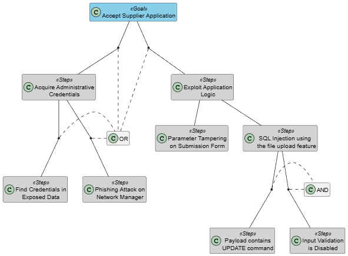
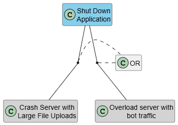

# Threat Analysis: Supplier Application Process

## 1. Threat Categorization (STRIDE)

| Category | Description | Component & Type |
| :--- | :--- | :--- |
| **Spoofing** | **Threat 1:** A user pretends to be a Supplier. And submit fraudulent certificates to bypass food safety protocols. **Threat 2:** An unauthorized user spoofs the **Network Manager** and access the "Application Dashboard" to approve their applications. | Supplier (Actor)   Network Manager (Actor)
| **Tampering** | **Threat 1:** An attacker modifies the "Submit Application Data" flow using **Parameter Tampering**. They change hidden fields (Nif, dates...) before the data reaches the **SupplierDB**. **Threat 2:** A user instead of giving legitimate certificates, gives malicious scripts. | Submit Application Data (Dataflow)   File Upload Service (Process)
| **Repudiation** | **Threat 1:** A Supplier denies uploading a specific file. If there isn´t a logging system, the system cannot prove that the user did that. | Application Handling Logic (Process)
| **Information Disclosure** | **Threat 1:** If URIs of the certificates are predictable, any user can try and view private information of other suppliers certificates. **Threat 2:** If the "Fetch Supplier Records" flow lacks encryption, the information of all applicants could be exposed to unauthorized users. |File Reference URI (Dataflow)   Fetch Supplier Records (Dataflow)
| **Denial of Service** | **Threat 1:** **Resource Exhaustion**. An attacker inserts the **File Upload Service** with large files and fills the disk space of **FileStorage**. Consequently it prevents the other users to use the application. **Threat 2:** Using bots to create a lot of requests to **Application Handling Logic** to cause CPU overload. | FileStorage (Datastore)   Application Handling Logic (Process)
| **Elevation of Privilege** | **Threat 1:** If the urls of the application are not secure an authenticated user can manipulate the urls and access the **Application Dashboard**. | Application Dashboard (Dataflow)

---

## 2. Attack Tree:

### **Accept Supplier Application**

### **Shut Down System**

## 3. Misuse Cases

### **Predictable URL**

### **Script Injection**
