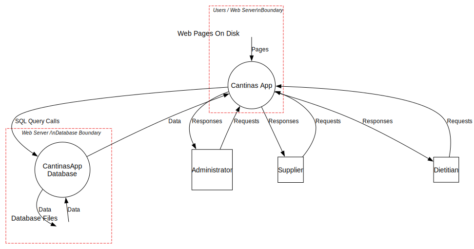
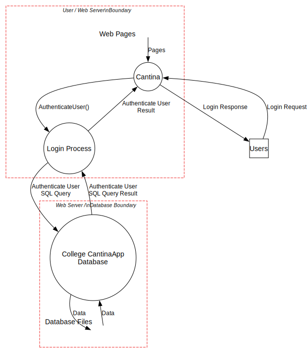
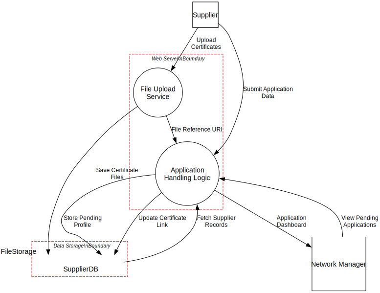
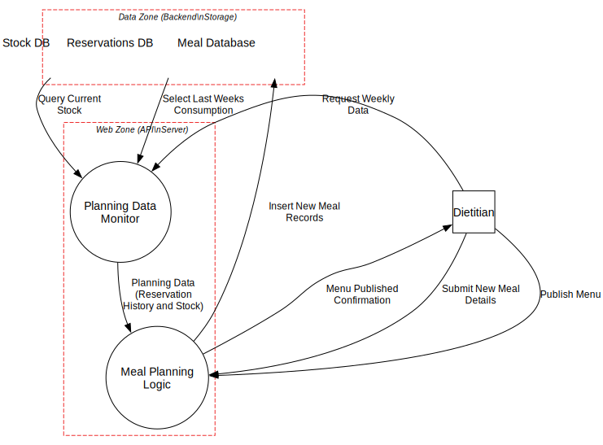

## DataFlows:

### **DFDS Level 0**

### **DFDS Level 1 - Login**
This diagram focuses on the Authentication Process.

### **DFDS Level 1 - Supplier Applcation**
This diagram focuses on the registration of the supplier application.

### **DFDS Level 1 - Meal Planning**
This diagram focuses on the creating of the meals by the dietition.
