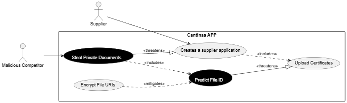
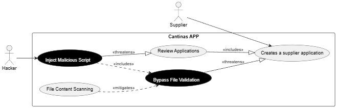

# Abuse / Misuse Cases

## 1. Predictable URLs

### Actors

| Actor                |
| -------------------- |
| Supplier             |
| Malicious Competitor |

### Legitimate Use Cases

| Use Case                       |
| ------------------------------ |
| Creates a supplier application |
| Upload Certificates            |

### Misuse Cases

| Misuse Case            |
| ---------------------- |
| Steal Private Documents |
| Predict File ID        |

### Mitigations

| Mitigation         |
| ------------------ |
| Encrypt File URIs  |

### Relationships

| From                            | Relationship | To                              |
| ------------------------------- | ------------ | ------------------------------- |
| Supplier                        |              | Creates a supplier application  |
| Creates a supplier application  | includes     | Upload Certificates             |
| Malicious Competitor            |              | Steal Private Documents         |
| Steal Private Documents         | includes     | Predict File ID                 |
| Steal Private Documents         | threatens    | Creates a supplier application  |
| Predict File ID                 | threatens    | Upload Certificates             |
| Encrypt File URIs               | mitigates    | Predict File ID                 |

## 2. Script Injection

### Actors

| Actor    |
| -------- |
| Supplier |
| Hacker   |

### Legitimate Use Cases

| Use Case                       |
| ------------------------------ |
| Creates a supplier application |
| Review Applications            |

### Misuse Cases

| Misuse Case              |
| ------------------------ |
| Inject Malicious Script  |
| Bypass File Validation   |

### Mitigations

| Mitigation            |
| --------------------- |
| File Content Scanning |

### Relationships

| From                            | Relationship | To                              |
| ------------------------------- | ------------ | ------------------------------- |
| Supplier                        |              | Creates a supplier application  |
| Review Applications             | includes     | Creates a supplier application  |
| Hacker                          |              | Inject Malicious Script         |
| Inject Malicious Script         | includes     | Bypass File Validation          |
| Inject Malicious Script         | threatens    | Review Applications             |
| Bypass File Validation          | threatens    | Creates a supplier application  |
| File Content Scanning           | mitigates    | Bypass File Validation          |
