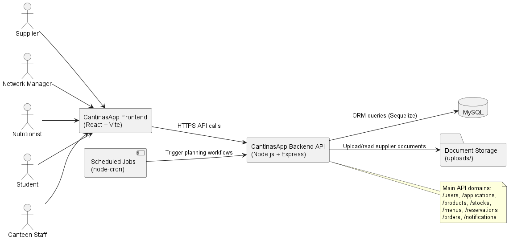
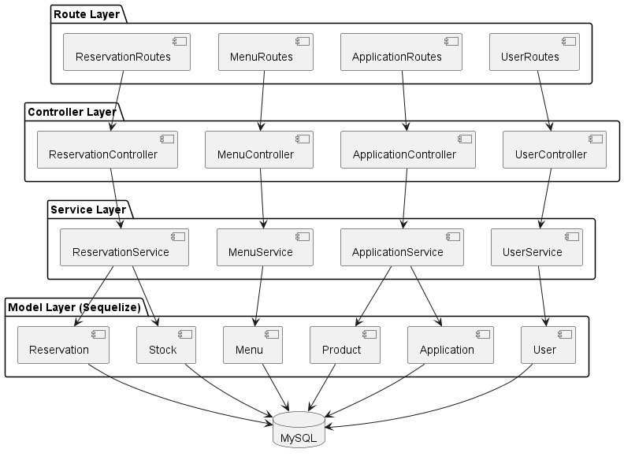
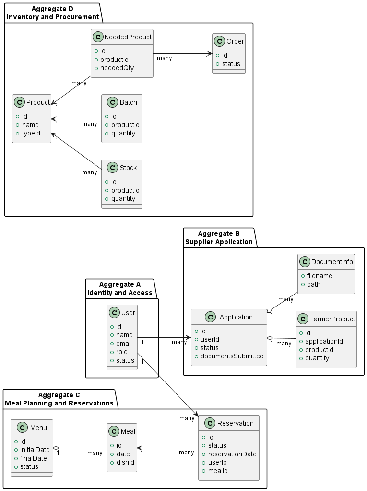

# Analysis - Phase 1

## 1. System Overview

CantinasApp is a canteen management platform for institutions. The backend provides REST APIs to manage:

- User and role management
- Supplier application and evaluation workflow
- Product, stock, and batch management
- Menu and meal planning
- Reservation and consumption tracking
- Needed products and order planning
- Operational statistics and notifications

Main stakeholders:

- Supplier
- Network Manager
- Nutritionist
- Student
- Visitor
- Canteen and refectory operational roles

### 1.1 System Context Diagram

## 2. Architecture Overview

The solution follows a layered backend architecture:

- Route layer: HTTP endpoints and request routing
- Controller layer: request validation and orchestration
- Service layer: business logic and workflow rules
- Model layer: Sequelize entities and persistence mapping
- Data layer: MySQL relational database

Main runtime and framework choices:

- Node.js + Express backend API
- Sequelize ORM
- MySQL database
- JWT middleware for authentication support
- Multer for multipart file upload handling
- Cron jobs for periodic planning operations

### 2.1 Layered Architecture Diagram

## 3. Domain Model and Aggregates

The project domain is broad. For DDD-oriented decomposition, the current model can be interpreted with at least the following aggregates.

### 3.1 Domain Aggregates Diagram

### Aggregate A - Identity and Access

Primary entity:

- User

Responsibilities:

- Identity attributes and account status
- Role assignment for authorization decisions
- Mapping of users to operational locations where applicable

### Aggregate B - Supplier Application

Primary entity:

- Application

Related entities:

- FarmerProducts
- Document metadata linked to uploaded files

Responsibilities:

- Supplier application submission and update
- Application status transitions (submitted, approved, rejected, etc.)
- Document submission and retrieval

### Aggregate C - Meal Planning and Reservations

Primary entities:

- Menu
- Meal
- Reservation

Responsibilities:

- Weekly/periodic menu definition
- Meal publication and association with canteen/refectory context
- Reservation lifecycle for users

### Aggregate D - Inventory and Procurement

Primary entities:

- Product
- Stock
- Batch
- NeededProduct
- Order

Responsibilities:

- Track available products and stock
- Derive needed products from published menus
- Support order planning and adjustment

## 4. Major Components

Key API domains currently exposed by the backend include:

- /users
- /applications
- /products
- /stocks
- /batches
- /menus
- /meals
- /reservations
- /orders
- /notifications
- /statistics
- /waste-reports

## 5. Functional Requirements (Phase 1 View)

The following functional requirements are in scope for analysis and design:

- FR-01: Manage users and role profiles.
- FR-02: Allow suppliers to submit and update applications.
- FR-03: Store and retrieve supplier documents.
- FR-04: Manage products, batches, and stock records.
- FR-05: Create and publish menus and meals.
- FR-06: Handle user reservations and reservation updates.
- FR-07: Plan needed products and generate order-related workflows.
- FR-08: Provide operational metrics and notifications.

## 6. Non-Functional Requirements (Phase 1 View)

- NFR-01 Availability: Core APIs should remain available during normal operation.
- NFR-02 Reliability: Scheduled planning jobs should be resilient and observable.
- NFR-03 Maintainability: Layered architecture with separated concerns should be preserved.
- NFR-04 Scalability: The architecture should allow growth in users, reservations, and menu cycles.
- NFR-05 Data integrity: Relational modeling and validation should protect consistency.
- NFR-06 Security baseline: Authentication, authorization, validation, and secure communication requirements must be defined and tested.
