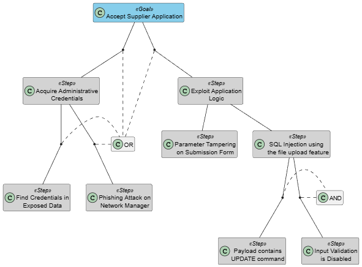
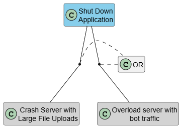
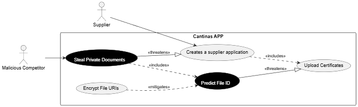
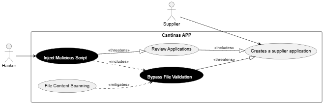
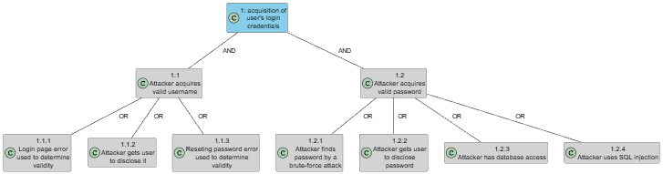

# 1 Threat Analysis: Supplier Application Process

## 1. Threat Categorization (STRIDE)

| Category | Description | Component & Type |
| :--- | :--- | :--- |
| **Spoofing** | **Threat 1:** A user pretends to be a Supplier. And submit fraudulent certificates to bypass food safety protocols. **Threat 2:** An unauthorized user spoofs the **Network Manager** and access the "Application Dashboard" to approve their applications. | Supplier (Actor)   Network Manager (Actor)
| **Tampering** | **Threat 1:** An attacker modifies the "Submit Application Data" flow using **Parameter Tampering**. They change hidden fields (Nif, dates...) before the data reaches the **SupplierDB**. **Threat 2:** A user instead of giving legitimate certificates, gives malicious scripts. | Submit Application Data (Dataflow)   File Upload Service (Process)
| **Repudiation** | **Threat 1:** A Supplier denies uploading a specific file. If there isn´t a logging system, the system cannot prove that the user did that. | Application Handling Logic (Process)
| **Information Disclosure** | **Threat 1:** If URIs of the certificates are predictable, any user can try and view private information of other suppliers certificates. **Threat 2:** If the "Fetch Supplier Records" flow lacks encryption, the information of all applicants could be exposed to unauthorized users. |File Reference URI (Dataflow)   Fetch Supplier Records (Dataflow)
| **Denial of Service** | **Threat 1:** **Resource Exhaustion**. An attacker inserts the **File Upload Service** with large files and fills the disk space of **FileStorage**. Consequently it prevents the other users to use the application. **Threat 2:** Using bots to create a lot of requests to **Application Handling Logic** to cause CPU overload. | FileStorage (Datastore)   Application Handling Logic (Process)
| **Elevation of Privilege** | **Threat 1:** If the urls of the application are not secure an authenticated user can manipulate the urls and access the **Application Dashboard**. | Application Dashboard (Dataflow)

---

## 1.2. Attack Tree:

### **Accept Supplier Application**

### **Shut Down System**

## 1.3. Misuse Cases

### **Predictable URL**

### **Script Injection**

# 2 Threat Analysis: Login

## Threat Categorization

| Category | Description | Component |
| :--- | :--- | :--- |
| **Spoofing** | **Threat 1:** The login feature need to be easy to use without introducing a threat that allows an attacker to gain access to user credentials.   **Threat 2:** Login in with another user account, by trying a lot of passwords. | Cantina |
| **Tampering** | **Threat 1:** If the Cantina App has the feature "Forgot Password". And if the feature is not secure, an attacker can change the user password. | Cantina |
| **Repudiation** | **Threat 1:** The attacker can deny logging with another user account if there isn't proper logging for the `Login Process`. | Login Process |
| **Information Disclosure** | **Threat 1:** Disclosing account information when the authentication fails. (If user email exists...) | Login Response |
| **Denial of Service** | **Threat 1:** An attacker sends a lot of login requests, and block users from login in.  | Login Process / Database |
| **Elevation of Privilege** | No Elevation of Privilege threats identified. |

## 2.1. Attack Tree:

### **Login in with account from another user**

# 3 Threat Analysis: Supplier Menu

## Threat Categorization

| Category | Potential Threat | Impacted Component |
| :--- | :--- | :--- |
| **Spoofing** | **Threat 1:** Unauthorized access to the Planning UI by mimicking the Dietitian's identity. | Dietitian / Web Zone |
| **Tampering** | **Threat 1:** There is a threat of an attacker intercepting and modifying the "Submit New Meal Details" or stock data from the Stock DB, leading to incorrect or dangerous meal planning. | Submit New Meal Details (Dataflow)   Stock DB (Datastore)
| **Repudiation** | No Repudiation threats identified. |
| **Information Disclosure** | **Threat 1:** Data streams that cross the boundary between the web zone and the storage zone (such as "Select Last Weeks Consumption") contain sensitive historical data. If these URIs or streams are not encrypted, consumption patterns and stock data may be exposed to third parties.| Select Last Weeks Consumption (Dataflow)   Storage Boundary |
| **Denial of Service** | **Threat 1:** An attacker could flood the Planning Data Monitor with complex data aggregation requests, that could cause CPU exhaustion and make the planning system unavailable to the Dietitian. | Planning Data Monitor (Process) |
| **Elevation of Privilege** | **Threat 1:** A user with only read permissions (Monitor) could attempt to manipulate API calls to access the "Insert New Meal Records" or "Publish Menu" logic, gaining write access to the Meal Database without authorization. | Meal Planning Logic (Process)   Meal Database (Datastore) |